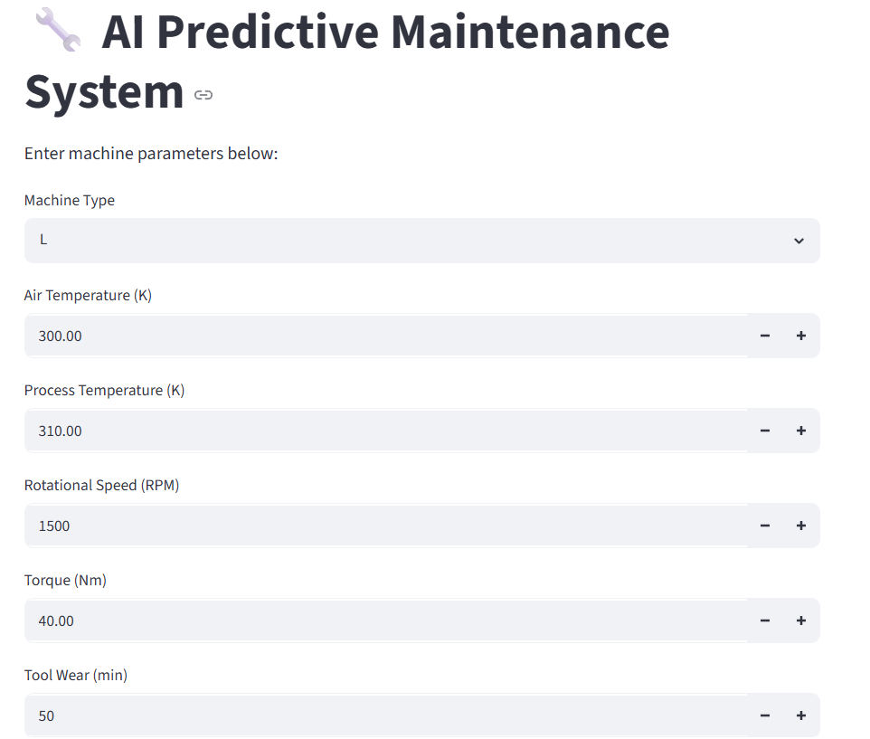
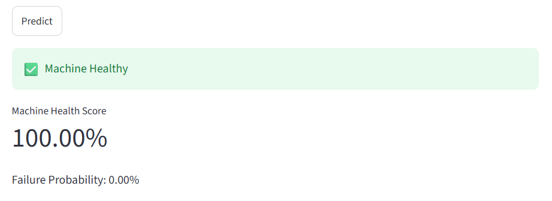
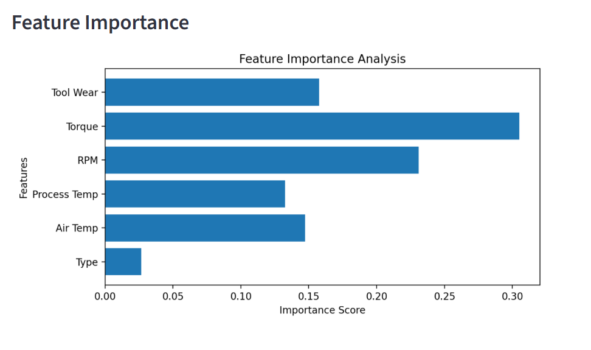

# 🔧 AI-Based Predictive Maintenance System

## 📌 Overview

This project predicts industrial machine failures using Machine Learning and provides an interactive Streamlit dashboard for real-time predictions.

---

## 🚀 Features

- Predict machine failure
- Machine health score
- Failure probability
- Feature importance visualization
- Interactive Streamlit dashboard

---

## 🛠 Technologies Used

- Python
- Pandas
- Scikit-Learn
- Streamlit
- Matplotlib
- Joblib

---

## 📊 Dataset

- AI4I 2020 Predictive Maintenance Dataset
- 10,000 machine records

---

## 🤖 Machine Learning Model

- Random Forest Classifier

## 📊 Model Performance

- Accuracy: 98.55%
- Precision (Failure Class): 88%
- Recall (Failure Class): 61%
- F1-Score (Failure Class): 72%

> The dataset is highly imbalanced (~3% failure cases). Therefore, Precision, Recall, and F1-score were used alongside Accuracy for model evaluation.

## 📈 Input Features

- Machine Type
- Air Temperature
- Process Temperature
- Rotational Speed
- Torque
- Tool Wear

---

## ▶️ Run Locally

Install dependencies

```bash
pip install -r requirements.txt
```

Train the model

```bash
python train.py
```

Run the Streamlit app

```bash
python -m streamlit run app.py
```

---

## 📷 Dashboard

### Main Dashboard



### Prediction Result



### Feature Importance



---

## 🔄 Workflow

1. Load the AI4I 2020 dataset
2. Clean and preprocess the data
3. Remove leakage columns
4. Train a Random Forest classifier
5. Save the trained model
6. Deploy the model using Streamlit
7. Predict machine health in real time

## Notes

During development, the failure subtype columns (TWF, HDF, PWF, OSF, RNF) were removed from the training data to avoid data leakage and ensure the model learns from operational parameters rather than outcome indicators.

## Key Findings

- Torque was the most influential feature in predicting machine failure.
- Rotational Speed (RPM) was the second most important feature.
- Tool Wear significantly impacted failure probability.
- The model achieved 98.55% accuracy while maintaining an F1-score of 72% on the failure class.

## 👩‍💻 Author

**Tirisha Biswas**
